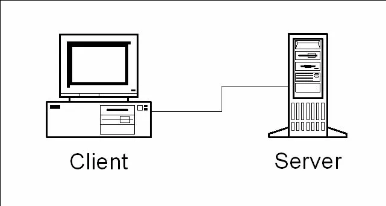
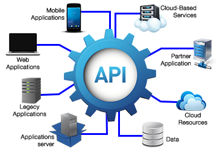

- [Клиент-серверная архитектура](#org8f86400)
- [HTTP](#org82954da)
- [API](#orgbf84cf5)
  - [JSON &#x2013; JavaScript Object Notation](#org19eb097)
  - [YAML &#x2013; Yet Another Markup Language](#org9071a53)
  - [XML](#org1840b21)
  - [BJSON (binary)](#org4f4a802)
  - [ProtoBuf (binary)](#org2d9960f)
  - [I](#org303f2c9)
  - [II](#orgd545983)
  - [III](#org5d78268)
- [Самописный API 1.](#org33c1c6b)
- [Самописный API 2.](#org987a5c7)
- [соединяем всё вместе](#orga72e604)
- [практика Microservices](#org72fac4d)
  - [API1](#org9e209b3)
  - [API2](#org0b271a3)
- [Почитать](#org869aeb0)
- [Вопросы?](#orgc4157a9)


<a id="org8f86400"></a>

# Клиент-серверная архитектура



```python
from django.http import HttpResponse


def index(request):
    return HttpResponse("<html><body>Привет</body></html>")  # -> str
    # в чём отличия от такого return?
    return "<html><body>Привет</body></html>"
```


<a id="org82954da"></a>

# HTTP

<span class="underline"><span class="underline">[Простым языком об HTTP](https://habr.com/ru/post/215117/?ysclid=l8xclejzey771685299)</span></span>

```bash
curl -v http://example.com 2>&1
```

```bash
  % Total    % Received % Xferd  Average Speed   Time    Time     Time  Current
                                 Dload  Upload   Total   Spent    Left  Speed

  0     0    0     0    0     0      0      0 --:--:-- --:--:-- --:--:--     0*   Trying 93.184.216.34:80...
* TCP_NODELAY set
*   Trying 2606:2800:220:1:248:1893:25c8:1946:80...
* TCP_NODELAY set
* Immediate connect fail for 2606:2800:220:1:248:1893:25c8:1946: Network is unreachable
* Connected to example.com (93.184.216.34) port 80 (#0)
> GET / HTTP/1.1
> Host: example.com
> User-Agent: curl/7.68.0
> Accept: */*
> 
* Mark bundle as not supporting multiuse
< HTTP/1.1 200 OK
< Accept-Ranges: bytes
< Age: 235682
< Cache-Control: max-age=604800
< Content-Type: text/html; charset=UTF-8
< Date: Sun, 09 Oct 2022 17:09:02 GMT
< Etag: "3147526947+ident"
< Expires: Sun, 16 Oct 2022 17:09:02 GMT
< Last-Modified: Thu, 17 Oct 2019 07:18:26 GMT
< Server: ECS (nyb/1D1B)
< Vary: Accept-Encoding
< X-Cache: HIT
< Content-Length: 1256
< 
{ [1256 bytes data]

100  1256  100  1256    0     0   1754      0 --:--:-- --:--:-- --:--:--  1751
100  1256  100  1256    0     0   1754      0 --:--:-- --:--:-- --:--:--  1751
* Connection #0 to host example.com left intact
<!doctype html>
<html>
<head>
    <title>Example Domain</title>

    <meta charset="utf-8" />
    <meta http-equiv="Content-type" content="text/html; charset=utf-8" />
    <meta name="viewport" content="width=device-width, initial-scale=1" />
    <style type="text/css">
    body {
        background-color: #f0f0f2;
        margin: 0;
        padding: 0;
        font-family: -apple-system, system-ui, BlinkMacSystemFont, "Segoe UI", "Open Sans", "Helvetica Neue", Helvetica, Arial, sans-serif;

    }
    div {
        width: 600px;
        margin: 5em auto;
        padding: 2em;
        background-color: #fdfdff;
        border-radius: 0.5em;
        box-shadow: 2px 3px 7px 2px rgba(0,0,0,0.02);
    }
    a:link, a:visited {
        color: #38488f;
        text-decoration: none;
    }
    @media (max-width: 700px) {
        div {
            margin: 0 auto;
            width: auto;
        }
    }
    </style>
</head>

<body>
<div>
    <h1>Example Domain</h1>
    <p>This domain is for use in illustrative examples in documents. You may use this
    domain in literature without prior coordination or asking for permission.</p>
    <p><a href="https://www.iana.org/domains/example">More information...</a></p>
</div>
</body>
</html>
```


<a id="orgbf84cf5"></a>

# API



API — Application Programming Interface


<a id="org19eb097"></a>

## JSON &#x2013; JavaScript Object Notation

[&#x2026;] {}, True = true, False = false, None = null


<a id="org9071a53"></a>

## YAML &#x2013; Yet Another Markup Language


<a id="org1840b21"></a>

## XML


<a id="org4f4a802"></a>

## BJSON (binary)


<a id="org2d9960f"></a>

## ProtoBuf (binary)

-   GET myapi.ru/json/?search=foobar
-   GET myapi.ru/xml/?search=foobar
-   GET myapi.ru/?search=foobar&format=json


<a id="org303f2c9"></a>

## I

```bash
curl https://svatky.adresa.info/json | jq
```

```
[
  {
    "date": "0910",
    "name": "Štefan"
  },
  {
    "date": "0910",
    "name": "Sára"
  }
]
```


<a id="orgd545983"></a>

## II

```bash
curl https://svatky.adresa.info/json?date=0710 | jq
```

    [
      {
        "date": "0710",
        "name": "Justýna"
      }
    ]


<a id="org5d78268"></a>

## III

```bash
curl --output - https://http.cat/200
```


```bash
curl --output - https://http.cat/404
```


```bash
curl --output - https://http.cat/502
```


```bash
curl --output - https://http.cat/418
```


<a id="org33c1c6b"></a>

# Самописный API 1.

```python
import socket

HOST = '127.0.0.1'  # Standard loopback interface address (localhost)
PORT = 9010         # Port to listen on (non-privileged ports are > 1023)

with socket.socket(socket.AF_INET, socket.SOCK_STREAM) as s:
    s.bind((HOST, PORT))
    s.listen()
    conn, addr = s.accept()
    with conn:
        print('Connected by', addr)
        while True:
            data = conn.recv(1024)
            if not data:
                break
            conn.sendall(data)
```

```python
import socket

HOST = '127.0.0.1'
PORT = 9020

with socket.socket(socket.AF_INET, socket.SOCK_STREAM) as s:
    try:
        s.bind((HOST, PORT))
        s.listen()
        conn, addr = s.accept()
        with conn:
            print('Connected by', addr)
            while True:
                data = conn.recv(1024).decode('utf-8')
                if not data:
                    break
                try:
                    path = data.rstrip('\n').rstrip('\r')
                    print(repr(path))
                    with open(path, 'r') as fd:
                        conn.sendall((fd.read(1000) + '\r\n').encode('utf-8'))
                except Exception as e:
                    conn.sendall(str(e + '\r\n').encode('utf-8'))
    except Exception as e:
        print(e)
    finally:
        s.shutdown(socket.SHUT_RDWR)
```

```python
import io
import json
import http.server
import socketserver
from http import HTTPStatus
from datetime import datetime as dt

class MyHttpRequestHandler(http.server.SimpleHTTPRequestHandler):
    def do_GET(self):
        now = dt.now()
        data = json.dumps({
            "dt": now.strftime("%Y%m%d:%T"),
            "ts": int(now.timestamp())
        })
        s_data = io.BytesIO()
        s_data.write(data.encode("utf-8"))
        s_data.seek(0)
        self.send_response(HTTPStatus.OK)
        self.send_header("Content-type", "application/json")
        self.send_header("Content-Length", str(len(data)))
        self.end_headers()
        self.copyfile(s_data, self.wfile)

my_server = socketserver.TCPServer(("", 9020), MyHttpRequestHandler)

# Star the server
my_server.serve_forever()
```


<a id="org987a5c7"></a>

# Самописный API 2.

[foobar]("foobar/")


<a id="orga72e604"></a>

# соединяем всё вместе

```html
<!DOCTYPE html>
<html>
  <head>
    <script
      src="https://code.jquery.com/jquery-3.6.1.min.js"
      integrity="sha256-o88AwQnZB+VDvE9tvIXrMQaPlFFSUTR+nldQm1LuPXQ="
      crossorigin="anonymous"></script>
    <script src="spa.js"></script>
  </head>
  <body>
    <div id="content">
    </div>
  </body>
</html>
```

```javascript
var send_log = function (level, message) {
    $.post("http://localhost:8000/api/log/", {level: level, message: message})
        .done( function (result) {
            console.log("SUCCESS: " + result);
        })
        .fail( function (result) {
            alert("FAIL: " + result);
        });
};

var read_notifications = function () {
    var ts_url = "http://localhost:9020";
    $.get(ts_url).done(function (result) {
        send_log("DBG", "Got current date data: " + result);
        $.get("http://localhost:8000/api/notify/", {"ts": result["ts"]})
            .done(function (notifications) {
                send_log("got " + notifications.length + " notifications");
                console.log(notifications);
            });
    }).fail(function (result) {send_log("ERR", result);});
}

$(document).ready(function () {
    var timerId = setInterval(read_notifications, 3000);
});
```


<a id="org72fac4d"></a>

# практика Microservices

```conf
server {
    listen 80;
    server_name localhost 127.0.0.1;

    location / {
       root /home/pimiento/yap/API_webinar;
       index index.html;
    }

    location /api/ts/ {
        proxy_pass http://localhost:9020;

    }

    location /api/ {
        proxy_pass http://localhost:8000;

        proxy_set_header X-Real-IP $remote_addr;
        proxy_set_header Host $host;
        proxy_set_header X-Forwarded-For $proxy_add_x_forwarded_for;
    }

}
```

```bash
sudo cp webinar.conf /etc/nginx/conf.d/
sudo nginx -t 2>&1
sudo nginx -s reload 2>&1
```

```javascript
var send_log = function (level, message) {
    $.post("/api/log/", {level: level, message: message})
        .done( function (result) {
            console.log("SUCCESS: " + result);
        })
        .fail( function (result) {
            console.log(result);
            alert("FAIL: send_log");
        });
};

var read_notifications = function () {
    $.get("/api/ts/", function (result) {
        send_log("DBG", "Got current date data: " + $.param(result));
        $.get("/api/notify/", {"ts": result["ts"]})
            .done(function (notifications) {
                send_log("INF", "got " + notifications.length + " notifications");
                console.log(notifications);
            });
    });
}

$(document).ready(function () {
    var timerId = setInterval(read_notifications, 800);
});
```

```html
<!DOCTYPE html>
<html lang="ru">
  <head>
    <meta charset="utf-8"/>
    <script
      src="https://code.jquery.com/jquery-3.6.1.min.js"
      integrity="sha256-o88AwQnZB+VDvE9tvIXrMQaPlFFSUTR+nldQm1LuPXQ="
      crossorigin="anonymous"></script>
    <script src="spa.js"></script>
  </head>
  <body>
    <div id="content">
      <form id="set-notify-form" accept-charset="utf-8">
        <div>
          <label for="id_sec">seconds later:</label>
          <input type="number" name="sec" required id="id_sec" min=1 max=86400>
        </div>
        <div>
          <label for="id_message">Message:</label>
          <textarea name="message" cols="40" rows="10" required id="id_message"></textarea>
        </div>
        <input type="submit"/>
      </form>
      <br/><br/>
      <div id="notifications">
      </div>
    </div>
  </body>
</html>
```

```javascript
var send_log = function (level, message) {
    $.post("/api/log/", {level: level, message: message})
        .done( function (result) {
            console.log("SUCCESS: " + result);
        })
        .fail( function (result) {
            console.log(result);
            alert("FAIL: send_log");
        });
};

var set_notify = function (delta, message) {
    // delta — activate notification delta seconds later
    // message — just a text
    var when = new Date();
    when.setSeconds(when.getSeconds() + delta);
    $.post("/api/notify/", {ts: when.toISOString(), message: message})
        .done( function () {
            send_log("INF", "set notification: " + when + " -- " + message);
        })
        .fail( function (result) {
            alert("FAIL: " + result);
            send_log("ERR", result);
        });
}

var read_notifications = function () {
    $.get("/api/ts/", function (result) {
        send_log("DBG", "Got current date data: " + $.param(result));
        $.get("/api/notify/", {"ts": result["ts"]})
            .done(function (notifications) {
                send_log("INF", "got " + notifications.length + " notifications");
                let container = $("#notifications");
                container.empty();
                for (const note in notifications) {
                    container.append(
                        '<p class="notification">'
                            + '<span class="notification_ts">'
                            + notifications[note]["ts"]
                            + ':&nbsp;</span><span class="notification_message">'
                            + notifications[note]["message"]
                            + '</span></p>'
                    );
                }
            });
    });
}

$(document).ready(function () {
    var timerId = setInterval(read_notifications, 3000);
    $("#set-notify-form").submit(function (e) {
        let data, form;
        e.preventDefault();
        form = $(this);
        data = form.serializeArray().reduce(function (obj, item) {
            obj[item.name] = item.value;
            return obj;
        }, {});
        this.reset();
        set_notify(data["sec"], data["message"]);
    });
});
```


<a id="org9e209b3"></a>

## API1

```bash
FROM python:3.8

WORKDIR /app
COPY my_django2.py .
CMD python my_django2.py
```


<a id="org0b271a3"></a>

## API2

```bash
FROM python:3.8

WORKDIR /app
COPY . .
RUN pip install -r requirements.txt
RUN rm -f db.sqlite3
RUN python manage.py migrate
CMD python manage.py runserver
```

```yaml
version: '3.8'

services:
  nginx:
    image: nginx:1.19.3
    ports:
      - 80:80
    volumes:
      - ./microservices.conf:/etc/nginx/conf.d/default.conf
      - ./index.html:/var/html/index.html
      - ./spa.js:/var/html/spa.js
    restart: always
    depends_on:
      - api1
      - api2

  api1:
    build:
      context: .
      dockerfile: Dockerfile

  api2:
    build:
      context: foobar
      dockerfile: Dockerfile
```

```conf
server {
    listen 80;
    # это будет дефолтный, не важно что написано в server_name, он единственный
    server_name localhost 127.0.0.1;

    location / {
       root /var/html;
       index index.html;
    }

    location /api/ts/ {
        proxy_pass http://api1:9020;

    }

    location /api/ {
        proxy_pass http://api2:8000;

        proxy_set_header X-Real-IP $remote_addr;
        proxy_set_header Host $host;
        proxy_set_header X-Forwarded-For $proxy_add_x_forwarded_for;
    }

}
```


<a id="org869aeb0"></a>

# Почитать

[Ошибки при проектировании API](https://habr.com/ru/company/yandex/blog/442762/)


<a id="orgc4157a9"></a>

# Вопросы?


